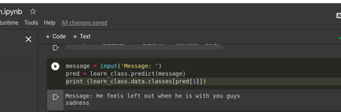
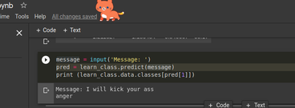

# Emotion Recognition 

## Table of contents

- [The challenge](#the-challenge)
  - [Overview](#overview)
- [My process](#my-process)
  - [Built with](#built-with)
  - [Result of classifier](#result-of-classifier)
  - [Useful resources](#useful-resources)
- [Author](#author)

## The challenge 

Create a program to determine the understanding of Natural Language processing and machine learning skills. Handson experience on Jupyter Notebook code.

### Overview

In this project, we have used NLP for predicting the emotions based on the message entered by the user. It predicts 6 emotions as follows: sadness, love, anger, joy, fear and surprise.

## My process

- You can save your model in .pkl file, which can be integrated in other webapps or mobile applications.
- Below is the link for .pkl file for trained model.
- [PKL file link](https://drive.google.com/file/d/1VqTczoGdhLwJX-fTPEXWw1HGOrA-VDOX/view?usp=sharing)

### Built with

- Python 3
- pandas
- fastai

### Result of classifier

### Useful resources

- [Text Message dataset](https://www.kaggle.com/parulpandey/emotion-dataset) 
- [Fastai Documentation](https://docs.fast.ai/) - This helped me for understanding all concepts of fastai library. This is the top of my list for machine learning development.

## Author

- [Abhinav Shukla](Programmer,TCS,Pune)